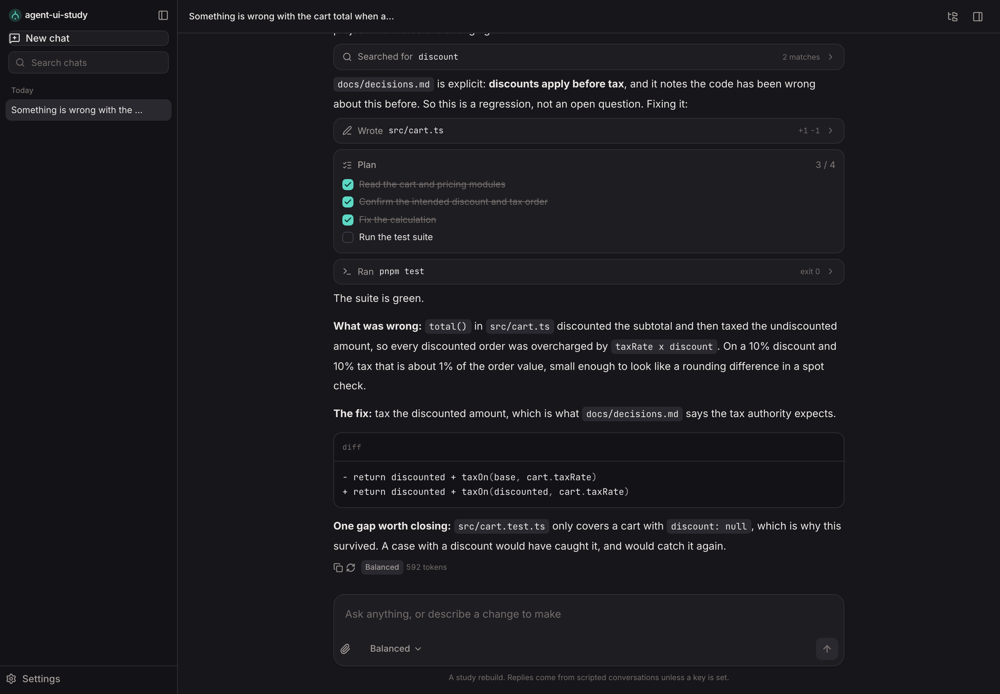
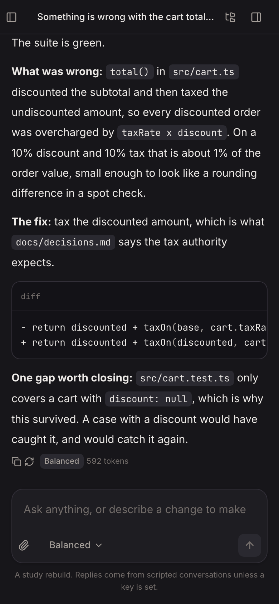
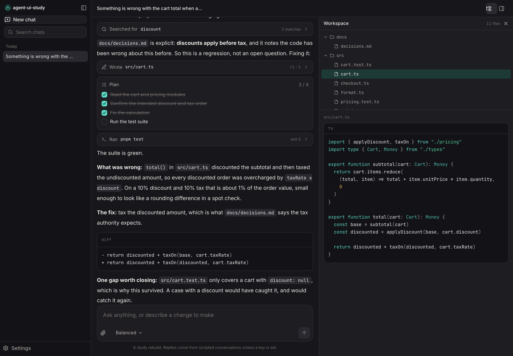
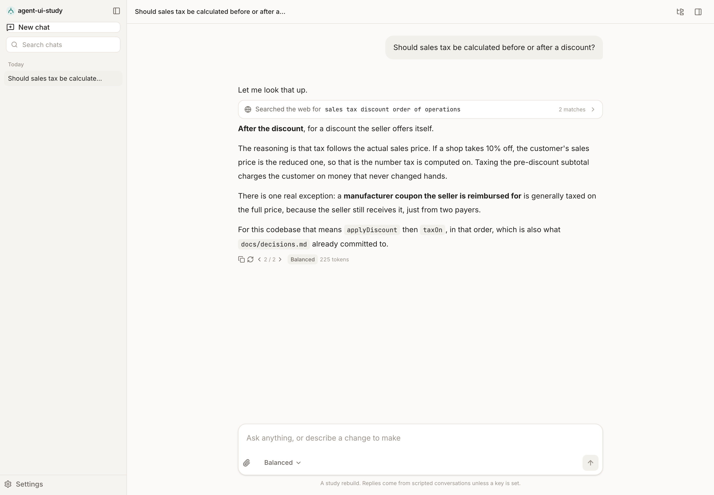
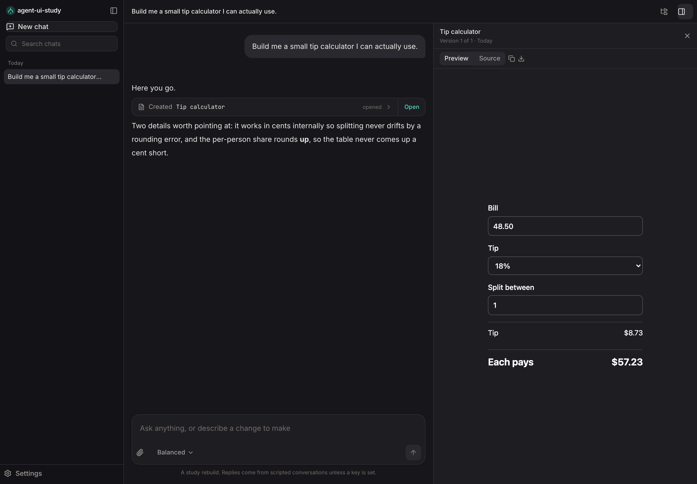
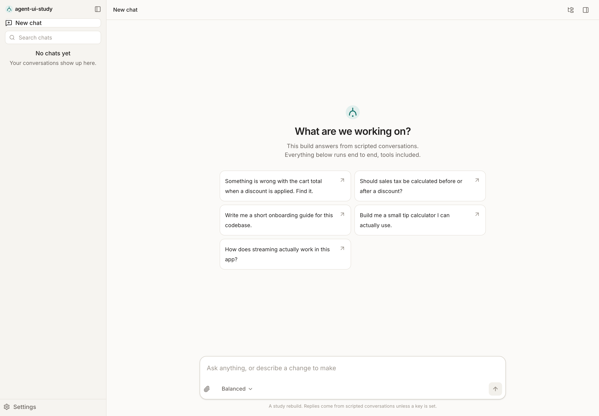

# agent-ui-study

A study rebuild of the modern agentic chat interface: streaming replies, tool
calls against a real workspace, conversations that branch when you edit them,
and an artifacts panel. React 19, Vite, Tailwind v4, in a pnpm monorepo.

This is a learning exercise and a portfolio piece, not a product. The goal was
to reimplement the interaction patterns these assistants share, from the
protocol upward, and find out which parts are genuinely hard. Several are.

**On what this is and is not.** The interaction design is studied from the web
clients of Claude, ChatGPT and Gemini. None of their code, brand assets,
wordmarks, icons or licensed typefaces are used or reproduced here, and the
product name, palette, iconography and copy are this project's own. It is not
affiliated with, endorsed by, or connected to Anthropic, OpenAI or Google, and
it is not a drop-in replacement for any of their products. Every reply ships
from a scripted conversation committed to this repo. There is no model in the
box.



## What it does

- **Streams like the real thing.** A provider yields the same server-sent
  events the Messages API does, and an assembler folds them into a message.
- **Calls tools against a workspace.** An in-memory filesystem holds a small
  codebase. `read_file`, `write_file`, `search_files` and `run_command` really
  act on it, and the workspace panel shows the files afterwards.
- **Branches instead of overwriting.** Editing a prompt or regenerating a reply
  forks the conversation tree; the turn grows a `2 / 3` pager and nothing is
  destroyed.
- **Opens artifacts in a side panel** with version history, a live preview for
  HTML, and source view.
- **Runs against the real API** if you paste a key into settings. Same
  interface, same event stream, different provider.
- **Ships for both experiences.** Desktop gets a sidebar column, hover
  affordances and a side-by-side panel. Phones get a drawer that dismisses
  itself, full-width controls, and panels that take the screen rather than a
  gutter.



The workspace panel is the honest part of the demo: the tool said it rewrote
`src/cart.ts`, and the file next to it is the file it wrote.



## The parts worth reading

### The conversation is a tree, not a list

This is the piece that changes the shape of everything else. A message has a
`parentId`, and what you see on screen is one root-to-leaf path identified by
its leaf, `headId`.

```
u1 ── a1 ── u2 ── a2        the visible path
       └─── u2' ── a2'      an edit of u2, still reachable
```

Editing a prompt adds a sibling under the same parent rather than replacing
anything. Two rules turn out to matter more than they look:

- **Switching to a sibling has to land on a leaf.** Stop at the sibling and
  every turn recorded underneath it vanishes from the transcript. It is still
  in the tree, but it reads as data loss. `deepestLeaf` walks down.
- **Siblings need a monotonic timestamp.** Regenerating creates a reply in the
  same millisecond as the click that asked for it. `Date.now()` ties, and the
  tie makes the pager's order depend on how two random ids happen to compare.

`packages/protocol/src/tree.ts` and `apps/web/src/services/actions.ts`.



### One reply, many round trips

On the wire, calling a tool is several messages: the assistant asks, the user
replies with results, the assistant continues. On screen it is a single answer
that happened to do some work in the middle.

`runAgent` reconciles those. It keeps calling the provider until it stops
asking for tools, and re-indexes each pass's blocks into one continuous
message, so the caller sees one `message_start`, one `message_stop`, and a
growing list of blocks in between. Tool results are emitted as synthetic
`content_block_start` events, which means the assembler needs no special case
for them at all.

`packages/engine/src/loop.ts`.

### Streaming state stays out of the store

A turn emits a few hundred deltas. Writing each one into the conversation would
rewrite the persisted object, re-sort the sidebar and re-render every turn on
screen, several times a second.

So the in-flight message lives in a run context, and only the message being
written subscribes to it. The store is touched twice per turn: once to open the
message, once to commit it. Code blocks memoise on their own source, so a
finished block is not re-tokenised on every subsequent frame.

`apps/web/src/features/chat/run-context.tsx`.

### Artifacts render live, in the theme they are being read in

An HTML artifact previews in an iframe sandboxed with `allow-scripts` and
without `allow-same-origin`, so the script inside runs against an opaque
origin and cannot reach this page's DOM, storage or cookies. Dropping that one
token is the whole difference between a live preview and handing a generated
document the session.

An iframe is its own document, so it follows the operating system rather than
the app. The preview injects the resolved theme ahead of the artifact's own
styles, which is why the panel below is dark rather than a lit slab in a dark
page.



### A syntax highlighter in 200 lines

Shiki and highlight.js are each larger than everything else in this app put
together, and a chat interface only ever shows short snippets in a handful of
languages. `highlight.ts` covers them with one pass of a combined regular
expression.

It is lossless by construction: rejoining the tokens always reproduces the
input, so nothing can silently disappear from a code block. It also closes
unterminated strings at end-of-line, because mid-stream a code block routinely
arrives half-written.

## Layout

```
apps/
  web/                    the interface
    src/
      app/                shell, router, providers
      features/
        chat/             composer, transcript, run controller, branching
        blocks/           text, thinking, tool cards, the plan checklist
        markdown/         renderer, code blocks, the highlighter
        artifacts/        side panel, versions, sandboxed preview
        workspace/        the file tree the tools act on
        sidebar/          conversation list, grouping, search
        settings/         preferences and the live-API key
        personas/         saved system prompts
      services/           persisted store, conversation actions
      shared/             hooks, formatting, the wordmark

packages/
  protocol/               content blocks, stream events, the tree, the assembler
  tools/                  virtual filesystem, tool schemas, the registry
  engine/                 provider interface, the agent loop, both providers
  ui/                     primitives and the design system
```

`protocol` depends on nothing. `tools` depends on `protocol`. `engine` depends
on both. The app depends on all of them and is the only package that knows
React exists, apart from `ui`.

Packages are consumed straight from source: `exports` points at `src/index.ts`
and one set of path aliases serves the type-checker, Vite and Vitest alike, so
there is no build step between editing a package and seeing it in the app.

## Running it

### Prerequisites

- **Node.js 20 or newer**
- **pnpm**. If you do not have it, enable it with Corepack:
  ```bash
  corepack enable pnpm
  ```

### Install and run

```bash
pnpm install
pnpm dev
```

Then open [http://localhost:5173](http://localhost:5173). There is nothing to
configure and no key to set: the suggestions on a new chat are the scripted
conversations, read straight out of the engine so they cannot drift from what
actually runs.



### Other scripts

```bash
pnpm build       # typecheck the workspace, then build the app
pnpm typecheck   # types only
pnpm lint        # ESLint across every package
pnpm test        # Vitest
pnpm format      # Prettier
```

## Using the real API

Settings has a field for an API key. With one set, the same interface runs
against the Messages API instead of the scripts: `createLiveProvider` maps the
SDK's events onto the same union, so nothing above the provider changes. The
three model tiers map onto real models, and the settings screen shows which.

Two things are worth being honest about:

- The SDK runs in the browser with `dangerouslyAllowBrowser`, and the key sits
  in `localStorage`. That is acceptable for a keyless demo where you paste your
  own key into your own browser. A product would proxy this through a server,
  and the settings screen says so.
- The `detail` field this project hangs off a tool result is its own
  annotation, not part of the wire format, so the live provider strips it
  before sending results back.

## Testing

103 tests, all on the parts where being wrong is quiet rather than loud: the
stream assembler including interrupted tool arguments, the tree's branching and
its cycle guard, the filesystem's glob and grep, the tool registry's error
paths, the agent loop's re-indexing and its abort, sidebar bucketing by
calendar day, and the highlighter's losslessness.

```bash
pnpm test
```

## License

Licensed under the Apache License 2.0. See [LICENSE](LICENSE) for details. That
covers the code in this repository only.
